# Project Scaffolder - MCP Agent

An intelligent project scaffolding agent that creates ready-to-use development projects through natural language conversation, built with MCP (Model Context Protocol).

## 🚀 Live Demo

**Try it now:** [https://test-keycardai-rv8wigyxy-dac4158s-projects.vercel.app](https://test-keycardai-rv8wigyxy-dac4158s-projects.vercel.app)

> Deployed on Vercel with automatic deployments from the `main` branch.

## Features

- 🤖 **AI-Powered**: Uses OpenAI GPT to understand project requirements
- 💬 **Chat Interface**: Natural language project creation
- 🛠️ **MCP Protocol**: Real MCP server implementation for tool orchestration
- 📁 **Template Library**: Pre-built templates for React, Next.js, and Node.js
- 🔧 **Git Integration**: Automatic repository initialization and commits
- ⚡ **Quick Setup**: Full project scaffolding in seconds

## Built With

- **Frontend**: Next.js 14 + TypeScript + React 18 + Tailwind CSS 3
- **AI Integration**: Vercel AI SDK + OpenAI GPT-3.5-turbo
- **Protocol**: MCP (Model Context Protocol) for agent communication
- **Templates**: React, Next.js, Node.js with modern tooling

## Getting Started

### Prerequisites

- **Node.js 18+** installed
- **Git** installed and configured
- **OpenAI API key** - Get yours from [OpenAI Platform](https://platform.openai.com/api-keys)

### ⚠️ Git Configuration Requirements

**IMPORTANT**: The MCP server uses your system's git configuration for all git operations.

#### Development Environment
- **User**: `aelf-fred <fred.tran@aelf.io>`
- **Source**: Global git config (`git config --global user.name/email`)

#### 🚨 Vercel Production Environment
- **⚠️ CRITICAL**: **NO git user configuration** in Vercel serverless environment
- **Git operations FAIL** without explicit user configuration
- **MANDATORY**: Always use `git_configure_user` before git operations in production

**Setup Git (if not already configured):**
```bash
git config --global user.name "Your Name"
git config --global user.email "your.email@example.com"
```

**For Generated Projects:**
- **Development**: Uses system's global git user by default OR environment variables
- **Production**: Uses environment variables automatically (recommended)
- **Environment Variables**: `GIT_USER_NAME` and `GIT_USER_EMAIL` (see `.env.example`)
- **Automatic workflow**: `git_init` (auto-configures from env vars) → `git_add_commit`
- **Manual workflow**: `git_init` → `git_configure_user` → `git_add_commit`

#### Environment Comparison
| Environment | Git Config | Status |
|-------------|------------|--------|
| **Development** | ✅ Global config OR env vars | Works automatically |
| **Vercel Production** | ✅ Environment variables | **Works with `GIT_USER_NAME/EMAIL`** |

### Installation

1. **Clone the repository:**
```bash
git clone https://github.com/cheshirecode/test-keycardai.git
cd test-keycardai
```

2. **Install dependencies:**
```bash
npm install
```

3. **Set up environment variables:**
```bash
# Copy the example environment file
cp .env.example .env.local

# Edit .env.local and add your configuration:
# OPENAI_API_KEY=your_actual_api_key_here
# GIT_USER_NAME=Your Name
# GIT_USER_EMAIL=your.email@example.com
```

> **⚠️ Important**: 
> - You **must** configure your OpenAI API key for the AI features to work
> - **Recommended**: Set `GIT_USER_NAME` and `GIT_USER_EMAIL` for automatic git configuration in generated projects

4. **Start the development server:**
```bash
npm run dev
```

5. **Open your browser:**
   Visit [http://localhost:3000](http://localhost:3000) to use the application.

## 🚀 Deployment Workflow

The project uses continuous deployment with Vercel and GitHub integration:

```mermaid
graph TD
    A[💻 Local Development] -->|git push| B[📦 GitHub Repository]
    B -->|webhook| C[🔄 Vercel Build Trigger]
    C --> D{🏗️ Build Process}
    D -->|✅ Success| E[🌐 Production Deployment]
    D -->|❌ Failure| F[📧 Build Error Notification]
    E --> G[🔗 Live URL Updated]

    H[🌿 Feature Branch Push] -->|webhook| I[👀 Preview Deployment]
    I --> J[🔍 Preview URL]

    K[⚙️ Environment Variables] --> C
    L[🔐 API Keys] --> K

    style E fill:#28a745
    style F fill:#dc3545
    style I fill:#17a2b8
    style A fill:#6f42c1
```



### Deployment Process

1. **Push to Main Branch** → Triggers production deployment
2. **Push to Feature Branch** → Creates preview deployment
3. **Environment Variables** → Automatically configured in Vercel
4. **Build Logs** → Available in Vercel dashboard

### Environment Variables in Production

The following environment variables are configured in Vercel:
- `OPENAI_API_KEY` - Encrypted and secure
- `GIT_USER_NAME` - For automatic git user configuration (e.g., "Project Scaffolder")
- `GIT_USER_EMAIL` - For automatic git user configuration (e.g., "scaffolder@example.com")
- `NODE_ENV` - Automatically set to `production`

## Usage

### Chat Commands

Simply describe what you want to build:

- "Create a React TypeScript app"
- "Build a Next.js project with Tailwind"
- "Create a Node.js API with Express"
- "Make a dashboard with authentication"

### Available Templates

1. **React TypeScript App**
   - Vite + React 18 + TypeScript + Tailwind CSS 3
   - ESLint + Hot Module Replacement

2. **Next.js Fullstack**
   - Next.js 14 + App Router + TypeScript
   - Tailwind CSS 3 + API Routes

3. **Node.js API**
   - Express + TypeScript + Jest
   - CORS + Helmet + Environment config

## MCP Integration

This project implements a real MCP server with the following tools:

- `create_directory`: Create project directories
- `write_file`: Write template files
- `git_init`: Initialize Git repository
- `git_add_commit`: Stage and commit changes
- `install_dependencies`: Install npm packages
- `setup_project_from_template`: Complete project setup

### MCP API

The MCP server is available at `/api/mcp` and follows JSON-RPC 2.0 specification.

Example request:
```bash
curl -X POST http://localhost:3000/api/mcp \
  -H "Content-Type: application/json" \
  -d '{
    "method": "get_project_templates",
    "params": {},
    "id": 1
  }'
```

## Architecture

```
test-keycardai/
├── app/
│   ├── api/mcp/           # MCP server implementation
│   ├── components/        # React components
│   └── page.tsx          # Main application
├── lib/
│   ├── templates/        # Project templates
│   ├── ai-service.ts     # AI integration
│   ├── mcp-client.ts     # MCP client
│   └── git-tools.ts      # Git utilities
├── types/
│   └── mcp.ts           # TypeScript definitions
└── docs/                # Comprehensive documentation
```

## Documentation

- [Solution Designs](./docs/SOLUTION_DESIGNS.md) - Complete design specifications
- [Implementation Guide](./docs/IMPLEMENTATION_GUIDE.md) - Step-by-step implementation
- [API Reference](./docs/API_REFERENCE.md) - MCP tools and endpoints

## Testing

The project uses **Vitest** for fast, modern testing with TypeScript support out of the box.

### Running Tests

```bash
# Run tests in watch mode (development)
npm test

# Run all tests once
npm run test:run

# Run tests with coverage report
npm run test:coverage

# Run tests with Vitest UI (browser-based interface)
npm run test:ui
```

### Test Structure

```
src/test/
├── setup.ts          # Global test configuration
app/components/
├── *.test.tsx         # Component tests
lib/
├── *.test.ts          # Utility and logic tests
```

### Writing Tests

Vitest provides a Jest-compatible API with additional features:

```typescript
import { describe, it, expect, vi } from 'vitest'
import { render, screen } from '@testing-library/react'

describe('MyComponent', () => {
  it('should render correctly', () => {
    render(<MyComponent />)
    expect(screen.getByText('Hello')).toBeInTheDocument()
  })

  it('should handle async operations', async () => {
    const result = await asyncFunction()
    expect(result).resolves.toBe('success')
  })
})
```

### Manual Testing

1. Start the development server
2. Test project creation with different templates
3. Verify generated projects can be built and run

### API Testing

Test MCP endpoints:
```bash
# Get available templates
curl -X GET http://localhost:3000/api/mcp

# Create a project
curl -X POST http://localhost:3000/api/mcp \
  -H "Content-Type: application/json" \
  -d '{
    "method": "setup_project_from_template",
    "params": {
      "projectPath": "/tmp/test-project",
      "templateId": "react-ts",
      "projectName": "my-test-app"
    },
    "id": 1
  }'
```

## Scripts

- `dev`: Start development server
- `build`: Build for production
- `start`: Start production server
- `test`: Run tests in watch mode (Vitest)
- `test:run`: Run tests once
- `test:coverage`: Run tests with coverage report
- `test:ui`: Run tests with Vitest UI
- `lint`: Run ESLint
- `lint:fix`: Run ESLint with auto-fix
- `type-check`: Run TypeScript type checking
- `prepare`: Install git hooks (runs automatically on npm install)
- `commitlint`: Validate commit message format

## Deployment

### Automatic Deployment (Recommended)

The project is configured for **continuous deployment**:

1. **Push to main branch** → Automatic production deployment
2. **Push to feature branch** → Automatic preview deployment
3. **Environment variables** are automatically applied from Vercel configuration

```bash
# Deploy to production
git push origin main

# Create preview deployment
git checkout -b feature/my-feature
git push origin feature/my-feature
```

### Manual Deployment

For manual control, use the Vercel CLI:

```bash
# Deploy to preview environment
vercel

# Deploy to production
vercel --prod

# Check deployment status
vercel ls
```

### Environment Configuration

**For Vercel deployment**, environment variables are managed through:
- Vercel Dashboard: https://vercel.com/dac4158s-projects/test-keycardai/settings/environment-variables
- Vercel CLI: `vercel env add VARIABLE_NAME`

**Current production environment:**
- ✅ `OPENAI_API_KEY` configured and encrypted
- ✅ Automatic deployments enabled
- ✅ Preview deployments for all branches

### 🚨 Vercel Production Limitations

**Git Operations in Production:**
- **⚠️ CRITICAL**: Vercel serverless environment has **NO system git configuration**
- **All git operations require explicit user setup** via `git_configure_user` MCP tool
- **Without user config**: Git operations will fail with authentication errors
- **Deployment authentication**: Commit authors must have Vercel project access

**Production Workflow Requirements:**
```bash
# RECOMMENDED: Set environment variables in Vercel dashboard
# GIT_USER_NAME=Project Scaffolder
# GIT_USER_EMAIL=scaffolder@example.com

# Automatic workflow (with environment variables)
1. git_init (auto-configures user from env vars)
2. git_add_commit (works automatically)

# Manual workflow (without environment variables)
1. git_init
2. git_configure_user (REQUIRED - will fail without this)
3. git_add_commit
```

**Deployment Authentication:**
- Git commit authors must have access to the Vercel project
- Mismatched commit authorship can cause deployment failures
- Use consistent email addresses between git config and Vercel account

## Development Workflow

### Git Hooks & Commit Standards

This project uses **lefthook** and **commitlint** to enforce code quality and conventional commit messages:

#### Pre-commit Hooks:
- **ESLint**: Automatically lints staged files
- **TypeScript**: Type-checks staged files
- **Auto-fix**: Automatically fixes linting issues when possible

#### Commit Message Format:
Follow [Conventional Commits](https://www.conventionalcommits.org/) specification:

```
type(scope?): description

[optional body]

[optional footer(s)]
```

**Examples:**
- `feat: add project scaffolding feature`
- `fix(mcp): resolve template generation issue`
- `docs: update API documentation`
- `refactor(ui): improve chat interface`

**Valid types:**
- `feat`: New feature
- `fix`: Bug fix
- `docs`: Documentation changes
- `style`: Code style changes
- `refactor`: Code refactoring
- `perf`: Performance improvements
- `test`: Adding or updating tests
- `build`: Build system changes
- `ci`: CI configuration changes
- `chore`: Other changes

#### Pre-push Hooks:
- **Build Check**: Ensures the project builds successfully before pushing

## Security Considerations

- **Input Validation**: All file paths and user inputs are validated
- **Sandboxing**: Project creation is isolated to specified directories
- **API Key Protection**: OpenAI API key stored in environment variables
- **Rate Limiting**: Consider implementing for production use

## Performance

- **Template Caching**: Templates loaded once at startup
- **Streaming**: Real-time progress updates
- **Error Handling**: Graceful degradation on failures
- **Memory Management**: Efficient file operations

## Future Enhancements

- **Additional Templates**: Vue, Angular, Python, Go projects
- **CI/CD Integration**: GitHub Actions, GitLab CI setup
- **Team Features**: Shared templates, collaboration tools
- **Advanced AI**: Multi-step project planning, architecture suggestions
- **Plugin System**: Custom template extensions

## Contributing

1. Fork the repository
2. Create a feature branch
3. Make your changes
4. Add tests if applicable
5. Submit a pull request

## License

MIT License - see [LICENSE](./LICENSE) file for details.

## Troubleshooting

### Common Issues

1. **OpenAI API Error**:
   - Check your API key is correctly set in `.env.local`
   - Verify the API key is valid at [OpenAI Platform](https://platform.openai.com/api-keys)
   - For Vercel deployment, ensure environment variable is set in dashboard

2. **Git Commands Fail**:
   - Ensure Git is installed and configured
   - Set global Git user: `git config --global user.name "Your Name"`
   - Set global Git email: `git config --global user.email "your.email@example.com"`

3. **Deployment Failures**:
   - Check build logs in Vercel dashboard
   - Verify environment variables are configured in Vercel
   - Ensure main branch is up to date: `git push origin main`

4. **Git Operations Fail in Production**:
   - **Error**: "Git author must have access to the project on Vercel"
   - **Cause**: No git user configuration in Vercel serverless environment
   - **Solution**: Always use `git_configure_user` before `git_add_commit` in production
   - **Example**: Set user with `git_configure_user` MCP tool before any git operations

5. **Vercel Authentication Issues**:
   - **Error**: Git commit author doesn't match Vercel account
   - **Solution**: Ensure git user email matches Vercel account email
   - **Check**: Verify commit authorship with proper user configuration

6. **Permission Errors**:
   - Check file system permissions for project creation
   - Ensure Node.js has write access to project directory

7. **Port Conflicts**:
   - Change the port in `next.config.js` if needed
   - Or use: `npm run dev -- --port 3001`

### Getting Help

- Check the [API Reference](./docs/API_REFERENCE.md) for detailed documentation
- Review [Implementation Guide](./docs/IMPLEMENTATION_GUIDE.md) for setup steps
- Open an issue for bugs or feature requests

---

**Project Scaffolder** - Creating the future, one project at a time. 🚀