# Project Scaffolder - MCP Agent

An intelligent project scaffolding agent that creates ready-to-use development projects through natural language conversation, built with MCP (Model Context Protocol).

## 🚀 Live Demo

**Try it now:** [https://test-keycardai-hmmx4tn4f-dac4158s-projects.vercel.app](https://test-keycardai-hmmx4tn4f-dac4158s-projects.vercel.app)

## 🏗️ System Architecture & Design

The Project Scaffolder uses a sophisticated architecture combining AI-powered decision making with modern web technologies:

```mermaid
graph TB
    %% User Interaction Layer
    User[👤 User] -->|Natural Language| ChatInterface[💬 Chat Interface]

    %% Frontend Layer
    ChatInterface -->|Project Request| Frontend[⚛️ Next.js Frontend]
    Frontend -->|WebSocket| MCPClient[🔌 MCP Client]

    %% MCP Server Layer
    MCPClient -->|JSON-RPC| MCPServer[🛠️ MCP Server]
    MCPServer -->|Tool Calls| MCPTools[🔧 MCP Tools]

    %% AI Decision Layer
    MCPTools -->|AI Analysis| AIService[🤖 AI Service]
    AIService -->|LLM Calls| OpenAI[🧠 OpenAI GPT-3.5-turbo]
    OpenAI -->|Responses| AIService
    AIService -->|Decisions| MCPTools

    %% Repository Management Layer
    MCPTools -->|Repository Ops| GitHubService[📦 GitHub Service]
    GitHubService -->|API Calls| GitHubAPI[🐙 GitHub API]
    GitHubAPI -->|Repository Data| GitHubService

    %% Template & Project Layer
    MCPTools -->|Template Loading| Templates[📁 Project Templates]
    Templates -->|Project Files| FileSystem[💾 File System]

    %% External Dependencies
    subgraph "🔐 External Services"
        OpenAI
        GitHubAPI
    end

    %% Environment Configuration
    subgraph "⚙️ Environment Config"
        Vercel[🌐 Vercel Deployment]
        EnvVars[🔑 Environment Variables]
        GitConfig[🔧 Git Configuration]
    end

    %% Styling
    classDef frontend fill:#e3f2fd,stroke:#1976d2,stroke-width:2px
    classDef mcp fill:#f3e5f5,stroke:#7b1fa2,stroke-width:2px
    classDef ai fill:#fff3e0,stroke:#f57c00,stroke-width:2px
    classDef github fill:#e8f5e8,stroke:#388e3c,stroke-width:2px
    classDef templates fill:#fce4ec,stroke:#c2185b,stroke-width:2px
    classDef external fill:#fafafa,stroke:#616161,stroke-width:2px

    class Frontend,ChatInterface,MCPClient frontend
    class MCPServer,MCPTools mcp
    class AIService ai
    class GitHubService,GitHubAPI github
    class Templates,FileSystem templates
    class OpenAI external
```



### **AI-Powered Decision Flow**

```mermaid
flowchart TD
    %% Input Processing
    Input[📝 User Input] -->|Natural Language| Analysis[🧠 AI Analysis]

    %% Decision Making
    Analysis -->|Template Selection| TemplateDecision{🎯 Template Decision}
    TemplateDecision -->|React TS| ReactTemplate[⚛️ React TypeScript]
    TemplateDecision -->|Next.js| NextJSTemplate[🌐 Next.js Fullstack]
    TemplateDecision -->|Node API| NodeTemplate[🚀 Node.js API]

    %% Project Planning
    Analysis -->|Feature Detection| FeatureAnalysis{🔍 Feature Analysis}
    FeatureAnalysis -->|Dependencies| DepPlanning[📦 Dependency Planning]
    FeatureAnalysis -->|Structure| StructurePlanning[🏗️ Structure Planning]

    %% Execution Planning
    Planning[📋 Execution Plan] -->|MCP Actions| ActionSequence[⚡ Action Sequence]

    %% Tool Execution
    ActionSequence -->|1. Create Project| ProjectCreation[📁 Project Creation]
    ActionSequence -->|2. GitHub Repo| GitHubRepo[🐙 GitHub Repository]
    ActionSequence -->|3. Dependencies| Dependencies[📚 Dependencies]
    ActionSequence -->|4. Initial Commit| InitialCommit[✅ Initial Commit]

    %% Output Generation
    ProjectCreation -->|Project Files| Output[🎉 Project Output]
    GitHubRepo -->|Repository URL| Output
    Dependencies -->|package.json| Output
    InitialCommit -->|Git History| Output

    %% Confidence & Reasoning
    Analysis -->|Confidence Score| Confidence[📊 Confidence: 95%]
    Analysis -->|Reasoning| Reasoning[💭 AI Reasoning: Optimal for user requirements]

    %% Styling
    classDef input fill:#e1f5fe
    classDef decision fill:#f3e5f5
    classDef planning fill:#e8f5e8
    classDef execution fill:#fff3e0
    classDef output fill:#fce4ec

    class Input,Analysis input
    class TemplateDecision,FeatureAnalysis decision
    class Planning,StructurePlanning,DepPlanning planning
    class ActionSequence,ProjectCreation,GitHubRepo,Dependencies,InitialCommit execution
    class Output,Confidence,Reasoning output
```



### **Design Philosophy**

The system is built on three core principles:

1. **AI-First Approach**: Every decision is powered by LLM intelligence - from template selection to dependency optimization
2. **Serverless Compatibility**: Pure GitHub API integration without local git dependencies for perfect Vercel deployment
3. **MCP Protocol Integration**: Standardized tool interface enables seamless AI-agent interactions and extensibility

### **Key Architectural Decisions**

- **Intelligent Agent Layer**: LLM processes natural language and makes informed decisions about project structure
- **GitHub API-Only**: No local git operations - everything works through HTTP APIs for serverless environments
- **Real MCP Server**: Full JSON-RPC 2.0 implementation enabling complex tool orchestration
- **TypeScript Throughout**: End-to-end type safety from frontend to AI service layer
- **Modular Component Design**: Clean separation enables easy testing and maintenance

## 🛠️ Tech Stack

### **Core Architecture**
- **Frontend**: Next.js 14 + TypeScript + React 18 + Tailwind CSS 3
- **MCP Server**: Custom JSON-RPC 2.0 implementation for tool orchestration
- **AI Engine**: Vercel AI SDK + OpenAI GPT-3.5-turbo for intelligent decision-making
- **GitHub Integration**: Octokit REST API for repository operations

### **AI & Intelligence Layer**
- **LLM Integration**: OpenAI GPT-3.5-turbo for natural language processing
- **Decision Making**: AI-powered template selection and project planning
- **Confidence Scoring**: AI provides confidence levels for all recommendations
- **Fallback Systems**: Graceful degradation when AI services unavailable

### **Development Tools**
- **Testing**: Vitest + React Testing Library + @testing-library/jest-dom
- **Linting**: ESLint + TypeScript strict mode
- **Code Quality**: Prettier + Commitlint + Lefthook pre-commit hooks
- **Type Safety**: Full TypeScript coverage with strict configuration

### **Deployment & Operations**
- **Platform**: Vercel with automatic deployments
- **Environment**: Serverless functions with 30s timeout
- **CI/CD**: GitHub integration with preview deployments
- **Monitoring**: Vercel analytics and function logs

## ✨ Features

### 🤖 **AI-Powered Intelligence**
- **Smart Template Selection**: AI analyzes requests to choose optimal project structures
- **Confidence Scoring**: AI provides reliability scores for all recommendations
- **Feature Detection**: Automatically identifies required dependencies from descriptions
- **Transparent Reasoning**: Chain of thought and MCP logs visible in chat interface

### 🔧 **GitHub API Integration**
- **Intelligent Owner Detection**: Automatically determines if GitHub owner is user or organization
- **Repository Automation**: Creates repositories with full project files via GitHub API
- **Organization Support**: Configurable `GITHUB_OWNER` for team/organization repositories
- **Serverless Compatible**: No local git dependencies - perfect for Vercel deployment

### 📁 **Project Templates**
- **React TypeScript**: Vite + React 18 + TypeScript + Tailwind CSS 3
- **Next.js Fullstack**: Next.js 14 + App Router + API Routes + Tailwind
- **Node.js API**: Express + TypeScript + Jest + Production-ready config

### ⚡ **Developer Experience**
- **Natural Language**: "Create a React app with authentication" → full working project
- **Real-time Progress**: Live updates with detailed execution logs and AI reasoning
- **One-Click Setup**: Complete project scaffolding in seconds with modern tooling

## 🚀 Quick Start

### Prerequisites
- **Node.js 18+** and **npm**
- **GitHub Personal Access Token** (scopes: `repo`, `user`)
- **OpenAI API Key** from [OpenAI Platform](https://platform.openai.com/api-keys)

### Installation

1. **Clone and install:**
```bash
git clone https://github.com/cheshirecode/test-keycardai.git
cd test-keycardai
npm install
```

2. **Configure environment:**
```bash
cp .env.example .env.local
# Edit .env.local with your API keys:
# OPENAI_API_KEY=sk-your-openai-key
# GITHUB_TOKEN=ghp_your-github-token
# GITHUB_OWNER=your-org-or-username  # Optional
```

3. **Start development:**
```bash
npm run dev
# Open http://localhost:3000
```

### Usage Examples

Simply describe what you want to build:
- "Create a React TypeScript app with Tailwind"
- "Build a Next.js dashboard with authentication"
- "Make a Node.js API with Express and TypeScript"

## 🤖 MCP Integration

### **AI-Enhanced MCP Tools**
- `analyze_project_request`: AI analyzes natural language requirements
- `generate_project_plan`: AI creates intelligent execution plans with confidence scoring
- `create_project_with_ai`: Complete AI-powered setup with GitHub repository creation
- `check_github_owner_type`: Intelligent detection of GitHub user vs organization accounts

### **MCP API Example**
```bash
curl -X POST http://localhost:3000/api/mcp \
  -H "Content-Type: application/json" \
  -d '{
    "method": "create_project_with_ai",
    "params": {
      "description": "Create a React app with authentication",
      "projectName": "my-auth-app"
    },
    "id": 1
  }'
```

## 📚 Documentation

- [API Reference](./docs/API_REFERENCE.md) - Complete MCP tools and endpoints
- [Implementation Guide](./docs/IMPLEMENTATION_GUIDE.md) - Detailed setup and configuration
- [Solution Designs](./docs/SOLUTION_DESIGNS.md) - Architecture and design decisions

## 🧪 Testing

```bash
npm test              # Watch mode
npm run test:coverage # Coverage report
npm run test:ui       # Browser-based UI
```

## 🚀 Deployment

### Automatic (Recommended)
- **Push to main** → Production deployment
- **Push to feature branch** → Preview deployment
- Environment variables configured in Vercel dashboard

### Manual
```bash
vercel          # Preview deployment
vercel --prod   # Production deployment
```

### Required Environment Variables
```bash
OPENAI_API_KEY=sk-...          # Required for AI features
GITHUB_TOKEN=ghp_...           # Required for GitHub operations
GITHUB_OWNER=mcp-integration   # Optional: target organization
GIT_USER_NAME=Project Scaffolder    # Recommended
GIT_USER_EMAIL=scaffolder@example.com  # Recommended
```

## 🔧 Development

### Scripts
- `npm run dev` - Development server
- `npm run build` - Production build
- `npm run test` - Run tests
- `npm run lint` - Code linting
- `npm run type-check` - TypeScript validation

### Commit Standards
Uses [Conventional Commits](https://www.conventionalcommits.org/):
```
feat: add new template support
fix(github): resolve repository creation issue
docs: update API documentation
```

## 🆕 Recent Updates

### **Production GitHub Organization Fix** (Latest)
- **Fixed**: Repositories now correctly created under configured organization instead of personal account
- **Enhanced**: Intelligent GitHub owner type detection (user vs organization)
- **Improved**: UI fallback logic respects `GITHUB_OWNER` configuration in all scenarios
- **Added**: Comprehensive verification rules for breaking changes

### **Repository File Upload Enhancement**
- **Fixed**: GitHub repositories contain full project files instead of just README
- **Enhanced**: Repository metadata storage system for proper file tracking
- **Improved**: Consistent repository naming and file upload process

### **Transparent AI Features**
- **Added**: Chain of thought reasoning visible in chat interface
- **Enhanced**: MCP server logs display for debugging and transparency
- **Improved**: Progressive disclosure pattern for technical information

## 🔍 Troubleshooting

### Common Issues

**OpenAI API Errors**: Verify `OPENAI_API_KEY` is set correctly
**GitHub Token Issues**: Ensure token has `repo` and `user` scopes
**Deployment Failures**: Check Vercel environment variables configuration
**Repository Creation**: Verify `GITHUB_OWNER` permissions for organization repositories

For detailed troubleshooting, see [Implementation Guide](./docs/IMPLEMENTATION_GUIDE.md).

## 🤝 Contributing

1. Fork the repository
2. Create a feature branch
3. Follow conventional commit format
4. Add tests for new features
5. Submit a pull request

## 📄 License

MIT License - see [LICENSE](./LICENSE) file for details.

---

**Project Scaffolder** - Creating the future, one project at a time. 🚀