# Project Scaffolder - MCP Agent

An intelligent project scaffolding agent that creates ready-to-use development projects through natural language conversation, built with MCP (Model Context Protocol).

## 🚀 Live Demo

**Try it now:** [https://test-keycardai-hmmx4tn4f-dac4158s-projects.vercel.app](https://test-keycardai-hmmx4tn4f-dac4158s-projects.vercel.app)

> Deployed on Vercel with automatic deployments from the `main` branch. Features complete AI-powered project creation with chain of thought reasoning and GitHub API integration.

## ✨ Features

### 🤖 **AI-Powered Decision Making**
- **Intelligent Template Selection**: AI analyzes natural language to choose optimal templates
- **Project Planning**: LLM generates step-by-step execution plans
- **Feature Detection**: Automatically identifies required features from user requests
- **Confidence Scoring**: AI provides confidence levels for recommendations
- **Fallback Behavior**: Graceful degradation when AI services unavailable

### 🛠️ **Advanced MCP Protocol**
- **Real MCP Server**: Full JSON-RPC 2.0 MCP implementation
- **AI-Enhanced Tools**: MCP tools use LLM for intelligent decision-making
- **Tool Orchestration**: Complex multi-step project creation workflows
- **Error Recovery**: AI-powered error analysis and recovery strategies

### 🔧 **GitHub API Integration**
- **Repository Automation**: Automatic GitHub repository creation with full project files
- **Organization Support**: Configurable GitHub organization/user for repository creation
- **Direct Commits**: No local git dependency - commits directly to GitHub via REST API
- **Repository Metadata**: Persistent repository tracking to ensure proper file uploads
- **Vercel Compatible**: Works seamlessly in serverless environments
- **Environment Variables**: Automatic git user and organization configuration from env vars

### 📁 **Template Library**
- **React TypeScript**: Vite + React 18 + TypeScript + Tailwind CSS 3
- **Next.js Fullstack**: Next.js 14 + App Router + API Routes + Tailwind
- **Node.js API**: Express + TypeScript + Jest + Production-ready config

### ⚡ **Developer Experience**
- **Natural Language**: "Create a React app with authentication" → full project
- **Transparent AI**: Chain of thought reasoning and MCP logs visible in chat
- **Real-time Progress**: Live updates during project creation with detailed execution logs
- **One-Click Setup**: Complete project scaffolding in seconds
- **Modern Tooling**: ESLint, Prettier, TypeScript, Vitest, Tailwind

## 🆕 Recent Updates

### **Repository File Upload Fix** (Latest)
- **Fixed**: GitHub repositories now contain full project files instead of just README
- **Enhanced**: Repository metadata storage system to track created repositories
- **Improved**: Timestamp consistency between repository creation and file uploads
- **Added**: Proper error handling for repository operations

### **Agent Response Restructuring**
- **Enhanced**: Chain of thought reasoning now appears at the beginning of responses
- **Added**: MCP server logs display for complete transparency
- **Improved**: Debugging sections expanded by default with better visual distinction
- **Optimized**: Progressive disclosure pattern for technical information

### **GitHub Organization Support**
- **Added**: `GITHUB_ORG` environment variable for configurable repository ownership
- **Enhanced**: Support for creating repositories under organizations or personal accounts
- **Improved**: Flexible repository creation targeting specific GitHub organizations

### **Documentation & Infrastructure**
- **Updated**: Comprehensive documentation reflecting all recent changes
- **Enhanced**: Environment variable configuration with organization support
- **Improved**: Vercel deployment configuration and setup instructions

## 🏗️ Built With

### **Core Architecture**
- **Frontend**: Next.js 14 + TypeScript + React 18 + Tailwind CSS 3
- **MCP Server**: Custom JSON-RPC 2.0 implementation for tool orchestration
- **AI Engine**: Vercel AI SDK + OpenAI GPT-3.5-turbo for intelligent decision-making
- **GitHub Integration**: Octokit REST API for repository operations

### **AI & Intelligence Layer**
- **LLM Integration**: OpenAI GPT-3.5-turbo for natural language processing
- **Decision Making**: AI-powered template selection and project planning
- **Confidence Scoring**: AI provides confidence levels for all recommendations
- **Fallback Systems**: Graceful degradation when AI services unavailable

### **Development Tools**
- **Testing**: Vitest + React Testing Library + @testing-library/jest-dom
- **Linting**: ESLint + TypeScript strict mode
- **Code Quality**: Prettier + Commitlint + Lefthook pre-commit hooks
- **Type Safety**: Full TypeScript coverage with strict configuration

## Getting Started

### Prerequisites

- **Node.js 18+** installed
- **GitHub Account** with Personal Access Token (PAT)
- **OpenAI API key** - Get yours from [OpenAI Platform](https://platform.openai.com/api-keys)
- **Vercel Account** (for deployment) - [Sign up here](https://vercel.com)

#### Required API Keys & Tokens

1. **OpenAI API Key** (for AI-powered decision making):
   - Visit [OpenAI Platform](https://platform.openai.com/api-keys)
   - Create new API key with GPT-3.5-turbo access
   - Required for all AI features (analysis, planning, recommendations)

2. **GitHub Personal Access Token** (for repository operations):
   - Visit [GitHub Settings > Tokens](https://github.com/settings/tokens)
   - Click "Generate new token (classic)"
   - Select scopes: `repo`, `user`
   - Required for GitHub repository creation and commits

### ⚠️ GitHub API Configuration Requirements

**IMPORTANT**: The system now uses GitHub API instead of local git CLI for all repository operations.

#### Development Environment
- **GitHub Integration**: Uses `GITHUB_TOKEN` for API operations
- **No Local Git Required**: All operations work through GitHub API
- **Environment Variables**: `GITHUB_TOKEN`, `GIT_USER_NAME`, `GIT_USER_EMAIL`

#### 🚀 Vercel Production Environment
- **✅ FULLY SUPPORTED**: GitHub API works perfectly in serverless environment
- **No Git Installation Required**: All operations use HTTP API calls
- **Automatic Configuration**: Environment variables configured automatically

**Required GitHub Token Setup:**
```bash
# 1. Create Personal Access Token at: https://github.com/settings/tokens
# 2. Required scopes: repo, user
# 3. Set in Vercel dashboard: https://vercel.com/dac4158s-projects/test-keycardai/settings/environment-variables
GITHUB_TOKEN=ghp_your_token_here
GIT_USER_NAME=Project Scaffolder
GIT_USER_EMAIL=scaffolder@cheshirecode.dev
```

**For Generated Projects:**
- **Repository Creation**: Automatic GitHub repository creation
- **Direct Commits**: Files committed directly to GitHub via API
- **No Local Git**: No `.git` directory or local git operations required
- **Vercel Compatible**: Perfect for serverless deployment environments

#### Environment Comparison
| Environment | GitHub API | Status |
|-------------|------------|--------|
| **Development** | ✅ GitHub token | Works with full AI features |
| **Vercel Production** | ✅ GitHub token | **Fully functional - no git CLI needed** |
| **Serverless** | ✅ HTTP-based API | **Perfect compatibility** |

### Installation

1. **Clone the repository:**
```bash
git clone https://github.com/cheshirecode/test-keycardai.git
cd test-keycardai
```

2. **Install dependencies:**
```bash
npm install
```

3. **Set up environment variables:**
```bash
# Copy the example environment file
cp .env.example .env.local

# Edit .env.local and add your API keys:
# Required for AI functionality
OPENAI_API_KEY=sk-your-openai-api-key-here

# Required for GitHub repository operations
GITHUB_TOKEN=ghp_your-github-token-here

# Optional but recommended for commit authorship
GIT_USER_NAME=Your Name
GIT_USER_EMAIL=your.email@example.com
```

> **⚠️ Important**:
> - **OpenAI API Key**: Required for all AI-powered features (analysis, planning, recommendations)
> - **GitHub Token**: Required for repository creation and commits (scopes: `repo`, `user`)
> - **Without these keys**: System works with reduced functionality (basic templates only)
> - **For production**: Configure these in Vercel dashboard

4. **Start the development server:**
```bash
npm run dev
```

5. **Open your browser:**
   Visit [http://localhost:3000](http://localhost:3000) to use the application.

## 🏗️ System Architecture

The Project Scaffolder uses a sophisticated architecture combining AI-powered decision making with modern web technologies:

```mermaid
graph TB
    %% User Interaction Layer
    User[👤 User] -->|Natural Language| ChatInterface[💬 Chat Interface]

    %% Frontend Layer
    ChatInterface -->|Project Request| Frontend[⚛️ Next.js Frontend]
    Frontend -->|WebSocket| MCPClient[🔌 MCP Client]

    %% MCP Server Layer
    MCPClient -->|JSON-RPC| MCPServer[🛠️ MCP Server]
    MCPServer -->|Tool Calls| MCPTools[🔧 MCP Tools]

    %% AI Decision Layer
    MCPTools -->|AI Analysis| AIService[🤖 AI Service]
    AIService -->|LLM Calls| OpenAI[🧠 OpenAI GPT-3.5-turbo]
    OpenAI -->|Responses| AIService
    AIService -->|Decisions| MCPTools

    %% Repository Management Layer
    MCPTools -->|Repository Ops| GitHubService[📦 GitHub Service]
    GitHubService -->|API Calls| GitHubAPI[🐙 GitHub API]
    GitHubAPI -->|Repository Data| GitHubService

    %% Template & Project Layer
    MCPTools -->|Template Loading| Templates[📁 Project Templates]
    Templates -->|Project Files| FileSystem[💾 File System]

    %% External Dependencies
    subgraph "🔐 External Services"
        OpenAI
        GitHubAPI
    end

    %% Environment Configuration
    subgraph "⚙️ Environment Config"
        Vercel[🌐 Vercel Deployment]
        EnvVars[🔑 Environment Variables]
        GitConfig[🔧 Git Configuration]
    end

    %% Styling
    classDef frontend fill:#e3f2fd,stroke:#1976d2,stroke-width:2px
    classDef mcp fill:#f3e5f5,stroke:#7b1fa2,stroke-width:2px
    classDef ai fill:#fff3e0,stroke:#f57c00,stroke-width:2px
    classDef github fill:#e8f5e8,stroke:#388e3c,stroke-width:2px
    classDef templates fill:#fce4ec,stroke:#c2185b,stroke-width:2px
    classDef external fill:#fafafa,stroke:#616161,stroke-width:2px

    class Frontend,ChatInterface,MCPClient frontend
    class MCPServer,MCPTools mcp
    class AIService ai
    class GitHubService,GitHubAPI github
    class Templates,FileSystem templates
    class OpenAI external
```



### **Data Flow & Decision Making**

```mermaid
flowchart TD
    %% Input Processing
    Input[📝 User Input] -->|Natural Language| Analysis[🧠 AI Analysis]

    %% Decision Making
    Analysis -->|Template Selection| TemplateDecision{🎯 Template Decision}
    TemplateDecision -->|React TS| ReactTemplate[⚛️ React TypeScript]
    TemplateDecision -->|Next.js| NextJSTemplate[🌐 Next.js Fullstack]
    TemplateDecision -->|Node API| NodeTemplate[🚀 Node.js API]

    %% Project Planning
    Analysis -->|Feature Detection| FeatureAnalysis{🔍 Feature Analysis}
    FeatureAnalysis -->|Dependencies| DepPlanning[📦 Dependency Planning]
    FeatureAnalysis -->|Structure| StructurePlanning[🏗️ Structure Planning]

    %% Execution Planning
    Planning[📋 Execution Plan] -->|MCP Actions| ActionSequence[⚡ Action Sequence]

    %% Tool Execution
    ActionSequence -->|1. Create Project| ProjectCreation[📁 Project Creation]
    ActionSequence -->|2. GitHub Repo| GitHubRepo[🐙 GitHub Repository]
    ActionSequence -->|3. Dependencies| Dependencies[📚 Dependencies]
    ActionSequence -->|4. Initial Commit| InitialCommit[✅ Initial Commit]

    %% Output Generation
    ProjectCreation -->|Project Files| Output[🎉 Project Output]
    GitHubRepo -->|Repository URL| Output
    Dependencies -->|package.json| Output
    InitialCommit -->|Git History| Output

    %% Confidence & Reasoning
    Analysis -->|Confidence Score| Confidence[📊 Confidence: 95%]
    Analysis -->|Reasoning| Reasoning[💭 AI Reasoning: Optimal for user requirements]

    %% Styling
    classDef input fill:#e1f5fe
    classDef decision fill:#f3e5f5
    classDef planning fill:#e8f5e8
    classDef execution fill:#fff3e0
    classDef output fill:#fce4ec

    class Input,Analysis input
    class TemplateDecision,FeatureAnalysis decision
    class Planning,StructurePlanning,DepPlanning planning
    class ActionSequence,ProjectCreation,GitHubRepo,Dependencies,InitialCommit execution
    class Output,Confidence,Reasoning output
```



### Deployment Process

1. **Push to Main Branch** → Triggers production deployment
2. **Push to Feature Branch** → Creates preview deployment
3. **Environment Variables** → Automatically configured in Vercel
4. **Build Logs** → Available in Vercel dashboard

### Environment Variables in Production

The following environment variables are configured in Vercel:

#### **AI & Intelligence**
- `OPENAI_API_KEY` - **Required** for AI-powered decision making and project analysis
- `NODE_ENV` - Automatically set to `production`

#### **GitHub Integration**
- `GITHUB_TOKEN` - **Required** for GitHub API repository operations
- `GITHUB_ORG` - **Optional** specify organization/user for repository creation (default: authenticated user)
- `GIT_USER_NAME` - **Recommended** for commit authorship (e.g., "Project Scaffolder")
- `GIT_USER_EMAIL` - **Recommended** for commit authorship (e.g., "scaffolder@cheshirecode.dev")

#### **Environment Configuration**
```bash
# Vercel Dashboard: https://vercel.com/dac4158s-projects/test-keycardai/settings/environment-variables
# All variables are encrypted and securely stored

# Production environment variables:
OPENAI_API_KEY=sk-...          # Required for AI functionality
GITHUB_TOKEN=ghp_...          # Required for GitHub API
GITHUB_ORG=mcp-integration     # Optional: target organization for repositories
GIT_USER_NAME=Project Scaffolder    # Optional but recommended
GIT_USER_EMAIL=scaffolder@cheshirecode.dev  # Optional but recommended
```

#### **Environment Variable Status**
- ✅ `OPENAI_API_KEY` - Configured and encrypted
- ✅ `GITHUB_TOKEN` - Configured and encrypted
- ✅ `GIT_USER_NAME` - Configured for automatic git user setup
- ✅ `GIT_USER_EMAIL` - Configured for automatic git user setup
- ✅ Automatic deployments enabled

## Usage

### Chat Commands

Simply describe what you want to build:

- "Create a React TypeScript app"
- "Build a Next.js project with Tailwind"
- "Create a Node.js API with Express"
- "Make a dashboard with authentication"

### Available Templates

1. **React TypeScript App**
   - Vite + React 18 + TypeScript + Tailwind CSS 3
   - ESLint + Hot Module Replacement

2. **Next.js Fullstack**
   - Next.js 14 + App Router + TypeScript
   - Tailwind CSS 3 + API Routes

3. **Node.js API**
   - Express + TypeScript + Jest
   - CORS + Helmet + Environment config

## 🤖 AI-Powered MCP Integration

This project implements an intelligent MCP server with AI-enhanced tools for automated project creation:

### **Core MCP Tools**
- `create_directory`: Create project directories
- `write_file`: Write template files with smart content replacement
- `install_dependencies`: Install npm packages with dependency analysis
- `setup_project_from_template`: Complete project setup with AI optimization

### **AI-Enhanced MCP Tools** ✨
- `analyze_project_request`: **AI analyzes natural language** to understand requirements
- `generate_project_plan`: **AI creates intelligent execution plans** with confidence scoring
- `intelligent_project_setup`: **Complete AI-powered setup** with auto-execution options
- `git_init`: **GitHub API integration** for repository creation (no local git needed)
- `git_add_commit`: **Direct GitHub commits** via API (Vercel-compatible)

### **MCP API Usage**

The MCP server is available at `/api/mcp` and follows JSON-RPC 2.0 specification.

#### **Basic Project Creation:**
```bash
curl -X POST http://localhost:3000/api/mcp \
  -H "Content-Type: application/json" \
  -d '{
    "method": "setup_project_from_template",
    "params": {
      "projectPath": "/tmp/my-react-app",
      "templateId": "react-ts",
      "projectName": "my-awesome-app"
    },
    "id": 1
  }'
```

#### **AI-Powered Project Creation:**
```bash
curl -X POST http://localhost:3000/api/mcp \
  -H "Content-Type: application/json" \
  -d '{
    "method": "intelligent_project_setup",
    "params": {
      "description": "Create a React app with authentication and dashboard",
      "projectPath": "/tmp/ai-project",
      "autoExecute": true
    },
    "id": 1
  }'
```

#### **AI Analysis Only:**
```bash
curl -X POST http://localhost:3000/api/mcp \
  -H "Content-Type: application/json" \
  -d '{
    "method": "analyze_project_request",
    "params": {
      "description": "Build a Next.js e-commerce site with payments"
    },
    "id": 1
  }'
```

### **AI Decision Flow**
1. **Natural Language Analysis**: AI understands user requirements
2. **Template Selection**: AI chooses optimal template with confidence score
3. **Feature Detection**: AI identifies required features and dependencies
4. **Plan Generation**: AI creates step-by-step execution plan
5. **Intelligent Execution**: Tools execute plan with AI guidance

## 🏗️ Updated Architecture

The system now features a sophisticated multi-layered architecture with AI at its core:

```
test-keycardai/
├── app/
│   ├── api/mcp/              # MCP server with AI-enhanced tools
│   ├── components/           # React components with real-time updates
│   └── page.tsx             # Main application interface
├── lib/
│   ├── ai-service.ts        # AI decision-making engine
│   ├── github-service.ts    # GitHub API integration
│   ├── repository-tools.ts  # Repository management (replaces git-tools)
│   ├── mcp-client.ts        # MCP client for tool orchestration
│   ├── templates/           # Project template library
│   └── hooks/               # React hooks for state management
├── types/
│   └── mcp.ts              # TypeScript definitions and schemas
├── docs/                   # Comprehensive documentation
└── src/test/               # Testing infrastructure with Vitest
```

### **Component Overview**

| Component | Purpose | Technology |
|-----------|---------|------------|
| **Chat Interface** | Natural language project requests | React + TypeScript |
| **MCP Server** | Tool orchestration and execution | Next.js API Routes |
| **AI Service** | Intelligent decision making | Vercel AI SDK + OpenAI |
| **GitHub Service** | Repository operations via API | Octokit + GitHub REST API |
| **Repository Tools** | Project creation and management | Node.js + File System |
| **Template Engine** | Project template rendering | Custom template system |
| **Testing Suite** | Quality assurance | Vitest + React Testing Library |

### **Key Architectural Decisions**

1. **AI-First Approach**: LLM integration for all major decisions
2. **GitHub API**: No local git dependency for serverless compatibility
3. **MCP Protocol**: Standardized tool interface for extensibility
4. **TypeScript**: Full type safety throughout the stack
5. **Modular Design**: Clean separation of concerns for maintainability

## Documentation

- [Solution Designs](./docs/SOLUTION_DESIGNS.md) - Complete design specifications
- [Implementation Guide](./docs/IMPLEMENTATION_GUIDE.md) - Step-by-step implementation
- [API Reference](./docs/API_REFERENCE.md) - MCP tools and endpoints

## Testing

The project uses **Vitest** for fast, modern testing with TypeScript support out of the box.

### Running Tests

```bash
# Run tests in watch mode (development)
npm test

# Run all tests once
npm run test:run

# Run tests with coverage report
npm run test:coverage

# Run tests with Vitest UI (browser-based interface)
npm run test:ui
```

### Test Structure

```
src/test/
├── setup.ts          # Global test configuration
app/components/
├── *.test.tsx         # Component tests
lib/
├── *.test.ts          # Utility and logic tests
```

### Writing Tests

Vitest provides a Jest-compatible API with additional features:

```typescript
import { describe, it, expect, vi } from 'vitest'
import { render, screen } from '@testing-library/react'

describe('MyComponent', () => {
  it('should render correctly', () => {
    render(<MyComponent />)
    expect(screen.getByText('Hello')).toBeInTheDocument()
  })

  it('should handle async operations', async () => {
    const result = await asyncFunction()
    expect(result).resolves.toBe('success')
  })
})
```

### Manual Testing

1. Start the development server
2. Test project creation with different templates
3. Verify generated projects can be built and run

### API Testing

Test MCP endpoints:
```bash
# Get available templates
curl -X GET http://localhost:3000/api/mcp

# Create a project
curl -X POST http://localhost:3000/api/mcp \
  -H "Content-Type: application/json" \
  -d '{
    "method": "setup_project_from_template",
    "params": {
      "projectPath": "/tmp/test-project",
      "templateId": "react-ts",
      "projectName": "my-test-app"
    },
    "id": 1
  }'
```

## Scripts

- `dev`: Start development server
- `build`: Build for production
- `start`: Start production server
- `test`: Run tests in watch mode (Vitest)
- `test:run`: Run tests once
- `test:coverage`: Run tests with coverage report
- `test:ui`: Run tests with Vitest UI
- `lint`: Run ESLint
- `lint:fix`: Run ESLint with auto-fix
- `type-check`: Run TypeScript type checking
- `prepare`: Install git hooks (runs automatically on npm install)
- `commitlint`: Validate commit message format

## Deployment

### Automatic Deployment (Recommended)

The project is configured for **continuous deployment**:

1. **Push to main branch** → Automatic production deployment
2. **Push to feature branch** → Automatic preview deployment
3. **Environment variables** are automatically applied from Vercel configuration

```bash
# Deploy to production
git push origin main

# Create preview deployment
git checkout -b feature/my-feature
git push origin feature/my-feature
```

### Manual Deployment

For manual control, use the Vercel CLI:

```bash
# Deploy to preview environment
vercel

# Deploy to production
vercel --prod

# Check deployment status
vercel ls
```

### Environment Configuration

**For Vercel deployment**, environment variables are managed through:
- Vercel Dashboard: https://vercel.com/dac4158s-projects/test-keycardai/settings/environment-variables
- Vercel CLI: `vercel env add VARIABLE_NAME`

**Current production environment:**
- ✅ `OPENAI_API_KEY` configured and encrypted
- ✅ Automatic deployments enabled
- ✅ Preview deployments for all branches

### 🚨 Vercel Production Limitations

**Git Operations in Production:**
- **⚠️ CRITICAL**: Vercel serverless environment has **NO system git configuration**
- **All git operations require explicit user setup** via `git_configure_user` MCP tool
- **Without user config**: Git operations will fail with authentication errors
- **Deployment authentication**: Commit authors must have Vercel project access

**Production Workflow Requirements:**
```bash
# RECOMMENDED: Set environment variables in Vercel dashboard
# GIT_USER_NAME=Project Scaffolder
# GIT_USER_EMAIL=scaffolder@example.com

# Automatic workflow (with environment variables)
1. git_init (auto-configures user from env vars)
2. git_add_commit (works automatically)

# Manual workflow (without environment variables)
1. git_init
2. git_configure_user (REQUIRED - will fail without this)
3. git_add_commit
```

**Deployment Authentication:**
- Git commit authors must have access to the Vercel project
- Mismatched commit authorship can cause deployment failures
- Use consistent email addresses between git config and Vercel account

## Development Workflow

### Git Hooks & Commit Standards

This project uses **lefthook** and **commitlint** to enforce code quality and conventional commit messages:

#### Pre-commit Hooks:
- **ESLint**: Automatically lints staged files
- **TypeScript**: Type-checks staged files
- **Auto-fix**: Automatically fixes linting issues when possible

#### Commit Message Format:
Follow [Conventional Commits](https://www.conventionalcommits.org/) specification:

```
type(scope?): description

[optional body]

[optional footer(s)]
```

**Examples:**
- `feat: add project scaffolding feature`
- `fix(mcp): resolve template generation issue`
- `docs: update API documentation`
- `refactor(ui): improve chat interface`

**Valid types:**
- `feat`: New feature
- `fix`: Bug fix
- `docs`: Documentation changes
- `style`: Code style changes
- `refactor`: Code refactoring
- `perf`: Performance improvements
- `test`: Adding or updating tests
- `build`: Build system changes
- `ci`: CI configuration changes
- `chore`: Other changes

#### Pre-push Hooks:
- **Build Check**: Ensures the project builds successfully before pushing

## Security Considerations

- **Input Validation**: All file paths and user inputs are validated
- **Sandboxing**: Project creation is isolated to specified directories
- **API Key Protection**: OpenAI API key stored in environment variables
- **Rate Limiting**: Consider implementing for production use

## Performance

- **Template Caching**: Templates loaded once at startup
- **Streaming**: Real-time progress updates
- **Error Handling**: Graceful degradation on failures
- **Memory Management**: Efficient file operations

## Future Enhancements

- **Additional Templates**: Vue, Angular, Python, Go projects
- **CI/CD Integration**: GitHub Actions, GitLab CI setup
- **Team Features**: Shared templates, collaboration tools
- **Advanced AI**: Multi-step project planning, architecture suggestions
- **Plugin System**: Custom template extensions

## Contributing

1. Fork the repository
2. Create a feature branch
3. Make your changes
4. Add tests if applicable
5. Submit a pull request

## License

MIT License - see [LICENSE](./LICENSE) file for details.

## Troubleshooting

### Common Issues & Solutions

#### **🤖 AI & LLM Related Issues**

1. **OpenAI API Error**:
   - **Error**: "OpenAI API key not configured" or rate limit errors
   - **Solution**: Verify `OPENAI_API_KEY` is set in Vercel dashboard
   - **Check**: Visit [OpenAI Platform](https://platform.openai.com/api-keys) to validate key
   - **Fallback**: System works with reduced functionality when AI unavailable

2. **AI Analysis Failures**:
   - **Error**: "AI analysis failed" or low confidence scores
   - **Cause**: Complex requirements or unclear natural language
   - **Solution**: Use more specific language or try `intelligent_project_setup` tool
   - **Debug**: Check Vercel function logs for detailed error messages

#### **🐙 GitHub API Issues**

3. **GitHub Token Errors**:
   - **Error**: "GitHub token not available" or 401/403 responses
   - **Solution**: Verify `GITHUB_TOKEN` has `repo` and `user` scopes
   - **Check**: Test token at [GitHub Settings > Tokens](https://github.com/settings/tokens)
   - **Scopes Required**: `repo`, `user` (for repository operations)

4. **Repository Creation Fails**:
   - **Error**: "Repository already exists" or permission denied
   - **Cause**: Repository name conflicts or insufficient token permissions
   - **Solution**: Check token permissions and ensure unique repository names
   - **Note**: Automatic naming prevents conflicts with timestamps

#### **🚀 Deployment & Production Issues**

5. **Vercel Deployment Failures**:
   - **Error**: Build errors or missing environment variables
   - **Solution**: Check Vercel dashboard build logs and environment configuration
   - **Required Variables**: `OPENAI_API_KEY`, `GITHUB_TOKEN` must be set
   - **Debug**: Use `vercel logs` or check dashboard for detailed error messages

6. **Environment Variable Issues**:
   - **Error**: "Environment variable not found" in production
   - **Solution**: Configure all variables in Vercel dashboard
   - **Check**: [Vercel Environment Variables](https://vercel.com/dac4158s-projects/test-keycardai/settings/environment-variables)
   - **Required**: All variables must be set for full functionality

#### **💻 Development Issues**

7. **Local Development Errors**:
   - **Error**: Port conflicts or missing dependencies
   - **Solution**: Use `npm run dev -- --port 3001` for port conflicts
   - **Check**: Ensure all dependencies installed with `npm install`
   - **Debug**: Check console logs for detailed error messages

8. **MCP Tool Failures**:
   - **Error**: "Tool not found" or execution errors
   - **Cause**: Tool not available or parameters incorrect
   - **Solution**: Use `get_project_templates` to see available tools
   - **Check**: Verify tool parameters match MCP schema

#### **🔧 Testing Issues**

9. **Test Failures**:
   - **Error**: Vitest errors or test timeouts
   - **Solution**: Run `npm run test:run` to see specific failures
   - **Check**: Ensure all dependencies installed and environment configured
   - **Debug**: Use `npm run test:ui` for interactive debugging

10. **Mock Issues**:
    - **Error**: "OpenAI API mock not working"
    - **Cause**: Test setup or mocking issues
    - **Solution**: Check `src/test/setup.ts` for proper mocking
    - **Fix**: Update test environment variables and mocks

#### **📦 Project Creation Issues**

11. **Project Generation Fails**:
    - **Error**: "Template not found" or file write errors
    - **Solution**: Use `get_project_templates` to verify available templates
    - **Check**: Ensure write permissions to target directory
    - **Debug**: Use `analyze_project_request` for AI analysis before creation

12. **Dependency Installation Issues**:
    - **Error**: npm install failures in generated projects
    - **Cause**: Network issues or incompatible package versions
    - **Solution**: Run `npm install` manually in generated project
    - **Check**: Verify Node.js version compatibility

### Getting Help

- Check the [API Reference](./docs/API_REFERENCE.md) for detailed documentation
- Review [Implementation Guide](./docs/IMPLEMENTATION_GUIDE.md) for setup steps
- Open an issue for bugs or feature requests

---

**Project Scaffolder** - Creating the future, one project at a time. 🚀